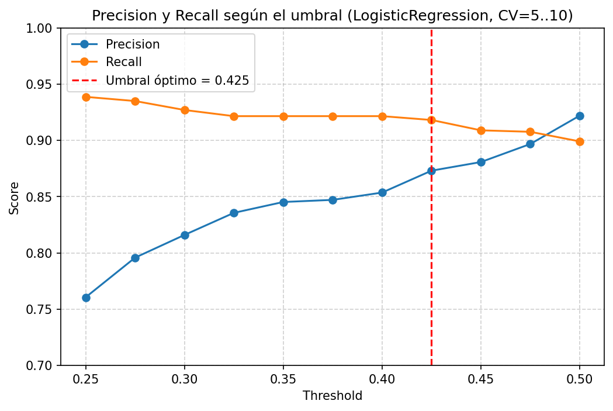
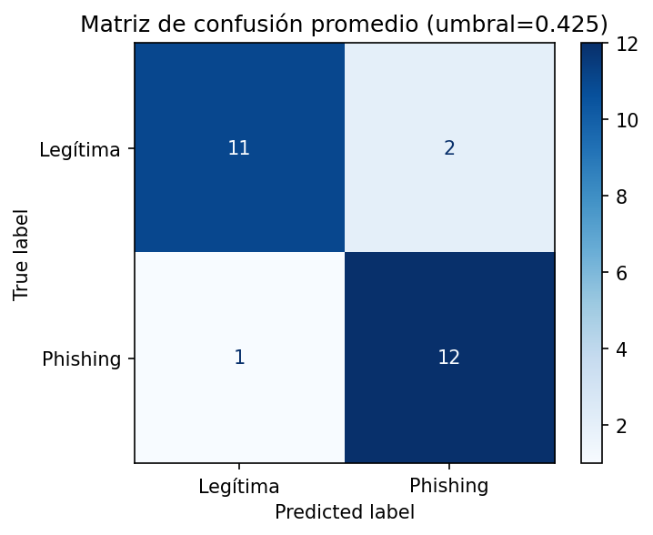
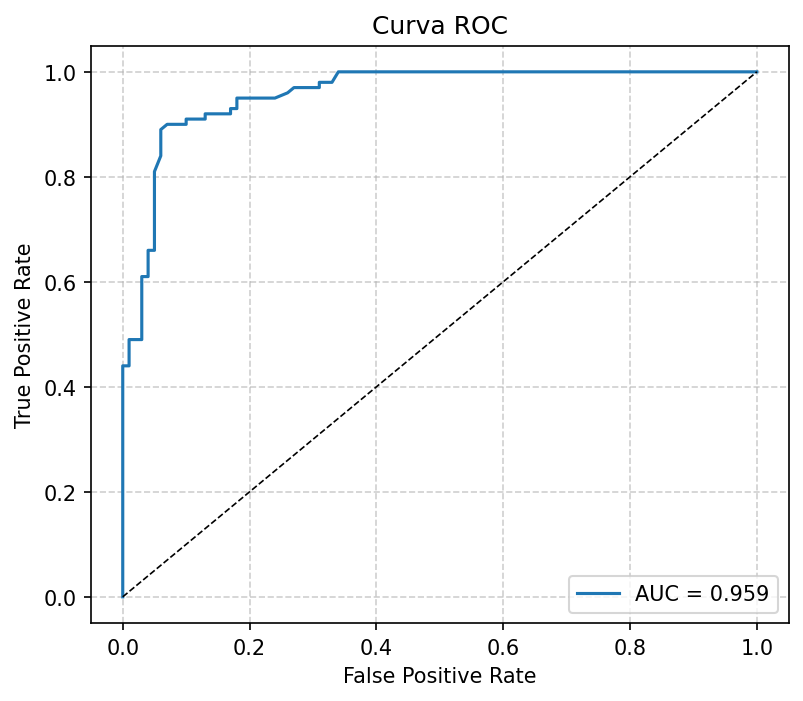
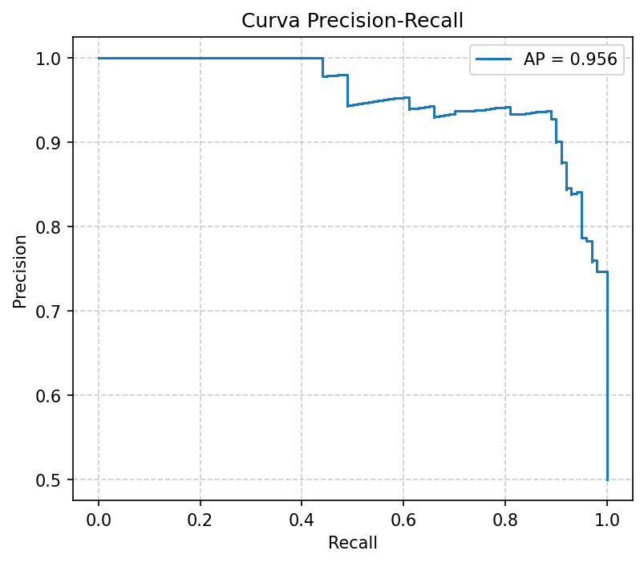
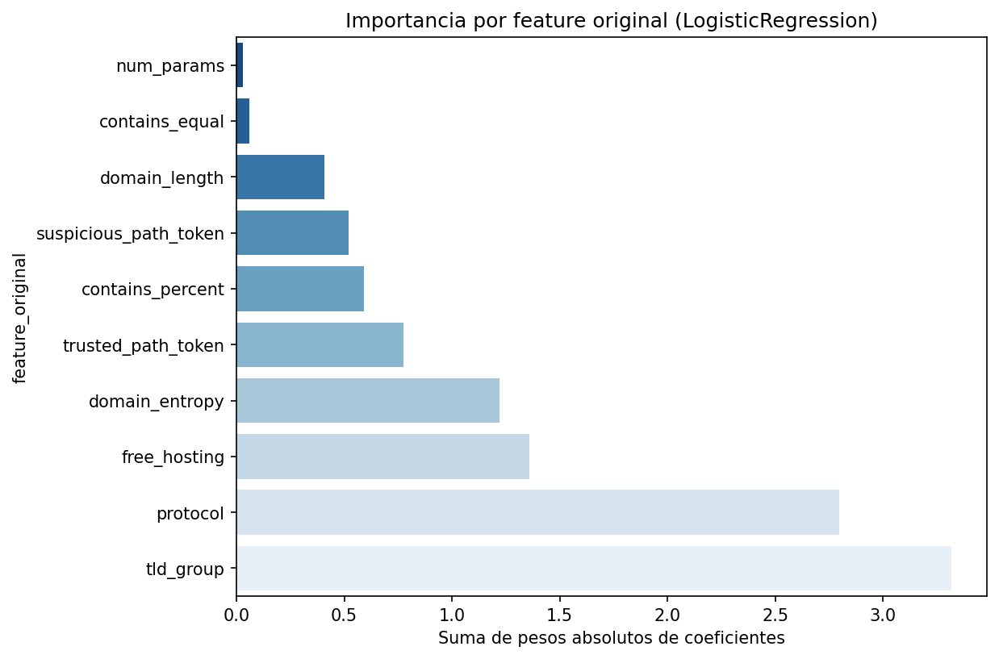

# 📌 Entrenamiento – Prototipo de detección de phishing

## Índice
1. [Introducción](#1-introducción)  
2. [Validación](#2-validación)  
3. [Modelos evaluados](#3-modelos-evaluados)  
4. [Selección de umbral](#4-selección-de-umbral)  
5. [Resultados finales](#5-resultados-finales)  
   - [Matriz de confusión](#51-matriz-de-confusión)  
   - [Curva ROC](#52-curva-roc)  
   - [Curva Precision-Recall](#53-curva-precision-recall)  
6. [Análisis por campañas](#6-análisis-por-campañas-matched_target)  
7. [Análisis por sectores](#7-análisis-por-sectores-categoria)  
8. [Conclusiones](#8-conclusiones)  
   - [Fortalezas](#fortalezas)  
   - [Debilidades](#debilidades)  
   - [Importancia de features](#importancia-de-features)  
   - [Próximos pasos](#próximos-pasos)

## 1. Introducción

Este notebook entrena y compara varios modelos de Machine Learning para un prototipo de detección de phishing en el contexto español.  

- **Dataset**: 200 URLs balanceadas  
  - 100 legítimas  
  - 100 phishing  
  - 10 features seleccionadas tras un EDA detallado  

- **Objetivo**: evaluar distintos algoritmos y comparar su rendimiento con validación cruzada, dado que el dataset es pequeño.  

- **Modelos considerados**:  
  - Regresión Logística (`LogisticRegression`)  
  - Máquinas de Vectores de Soporte (`SVC`)  
  - Bosques Aleatorios (`RandomForestClassifier`)  
  - XGBoost (`XGBClassifier`)  

- **Métricas de evaluación**:  
  - **Accuracy** → visión general.  
  - **Precision** → evitar falsos positivos (URLs legítimas mal bloqueadas).  
  - **Recall** → evitar falsos negativos (phishing que pasa desapercibido).  
  - **F1-score** → equilibrio entre precision y recall.  
  - **ROC-AUC** → capacidad global de separar phishing de legítimas.  
  - **Matriz de confusión** → análisis detallado de falsos positivos y negativos.  
  - **Specificity (TNR)** → asegurar que la mayoría de URLs legítimas no son clasificadas erróneamente como phishing.  

## 2. Validación

Se aplicó **validación cruzada estratificada (StratifiedKFold)** para mantener el balance de clases en cada fold.

- Se probaron valores de *k* entre **5 y 10** (incluyendo 5, 6, 7, 8, 9 y 10).  
- Para cada modelo y para cada valor de *k*, se calcularon métricas de rendimiento (Accuracy, Precision, Recall, F1 y ROC-AUC).  
- Posteriormente, se tomó la **media de los resultados obtenidos en todos los k (5..10)**, con el objetivo de:  
  - Reducir la varianza que se produciría al elegir un único valor de *k*.  
  - Obtener una estimación más estable en un dataset pequeño (200 URLs).  

👉 De este modo, la tabla de resultados presentada en la sección siguiente corresponde al **promedio de todas las validaciones cruzadas realizadas entre k=5 y k=10**.

## 3. Modelos evaluados

Se probaron cuatro algoritmos representativos:

- **Logistic Regression (LR)** → modelo lineal, interpretable y rápido de entrenar.  
- **SVC (lineal)** → buena opción para datasets pequeños, separa clases con un hiperplano óptimo.  
- **Random Forest (RF)** → ensamble de árboles, captura relaciones no lineales.  
- **XGBoost** → algoritmo de boosting, fuerte en datasets grandes pero propenso a sobreajuste con pocos datos.

### Resultados promedio (k=5..10)

| Modelo             | Accuracy | Precision | Recall | F1   | ROC-AUC |
|--------------------|----------|-----------|--------|------|---------|
| LogisticRegression | 0.907    | 0.922     | 0.898  | 0.906 | 0.946   |
| RandomForest       | 0.875    | 0.879     | 0.877  | 0.875 | 0.940   |
| SVC (linear)       | 0.885    | 0.889     | 0.893  | 0.886 | 0.947   |
| XGBoost            | 0.828    | 0.841     | 0.827  | 0.824 | 0.930   |

👉 **Logistic Regression** fue el modelo más equilibrado y explicable.

## 4. Selección de umbral

Se evaluaron distintos umbrales de decisión para la regresión logística (0.50 → 0.25, en pasos de 0.025).  
En cada caso se calcularon precisión, recall y F1 como media de validación cruzada estratificada con *k* = 5..10.

📈 *Gráfica Precision/Recall/F1 vs threshold:*  

👉 Se seleccionó **0.425** como umbral final, por maximizar el recall (~0.92) sin que la precisión se hunda (~0.87).

## 5. Resultados finales

### 5.1 Matriz de confusión

### 5.2 Curva ROC

### 5.3 Curva Precision-Recall

## 6. Análisis por campañas (`matched_target`)

👉 El modelo detecta bien campañas comunes en España (BBVA, Santander, Orange, DGT…) pero falla en targets poco representados:  
- CaixaBank → recall = 0.50  
- Correos → recall = 0.67  
- Microsoft, Outlook, WalletConnect → recall = 0.0

## 7. Análisis por sectores (`categoria`)

👉 Sectores fuertes: banca, telecomunicaciones, público.  
👉 Sectores débiles: logística (0.86), cripto (0.80), SaaS (0.67).

## 8. Conclusiones

### Fortalezas
- Buen rendimiento global: recall ≈0.92, precisión ≈0.87.  
- Interpretabilidad alta gracias a Logistic Regression.  
- Cobertura sólida en campañas comunes en España.

### Debilidades
- Dataset pequeño (200 URLs).  
- Recall bajo en SaaS, cripto y logística.  
- Recall nulo en algunos targets minoritarios.  
- Riesgo de sobreajuste y falta de validación externa.

### Importancia de features

👉 Se confirma que `tld_group`, `protocol` y `domain_entropy` son las señales más influyentes, mientras que `num_params` y `contains_equal` apenas aportan.

### Próximos pasos
1. Ampliar dataset en sectores débiles.  
2. Añadir nuevas features (typosquatting, fuzzy hashing).  
3. Validación externa en feeds distintos.  
4. Ajustar umbral según coste operativo de FPs/FNs.
