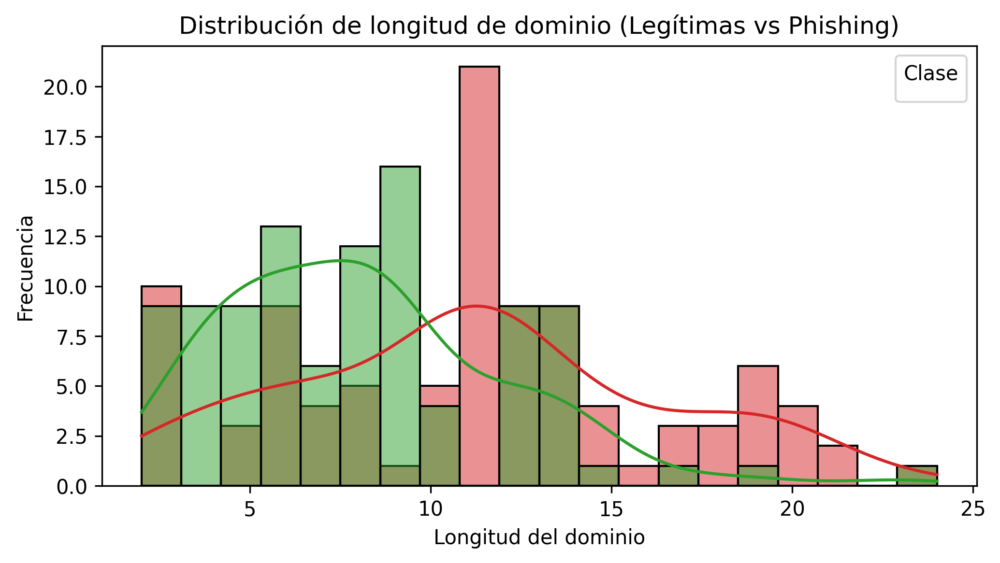
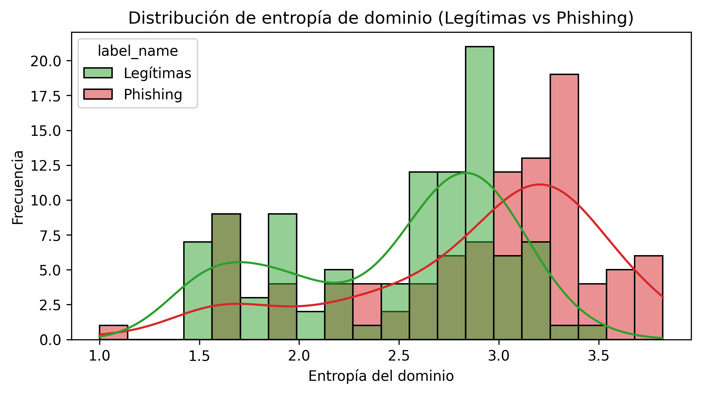
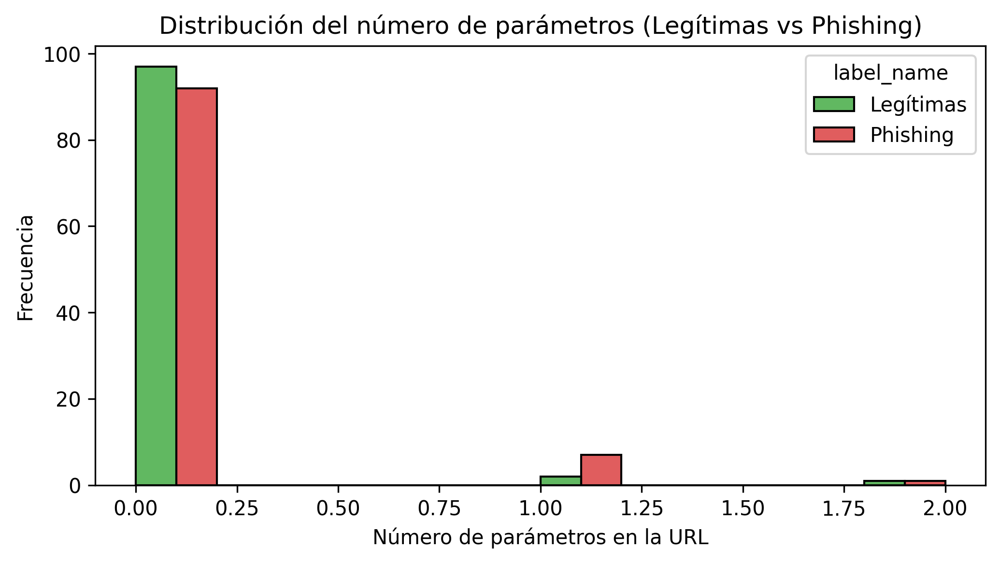
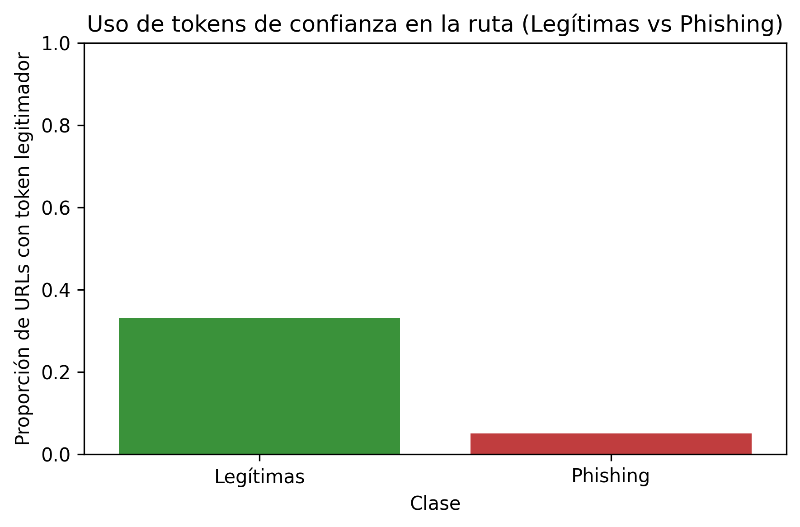
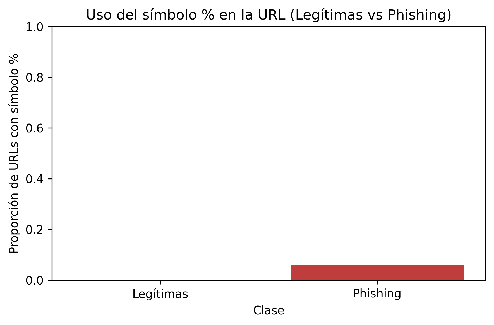
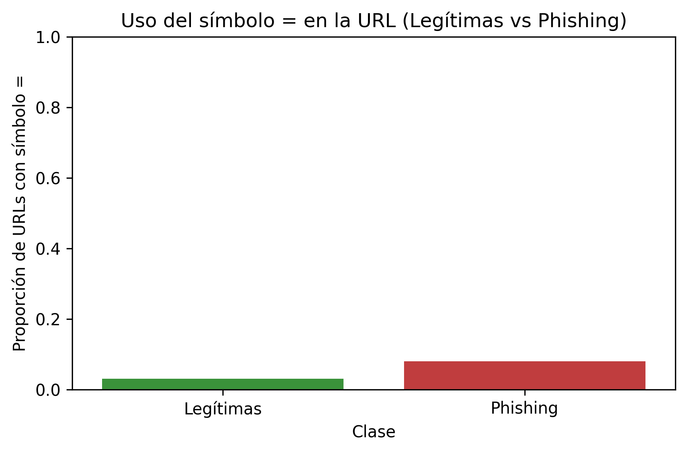
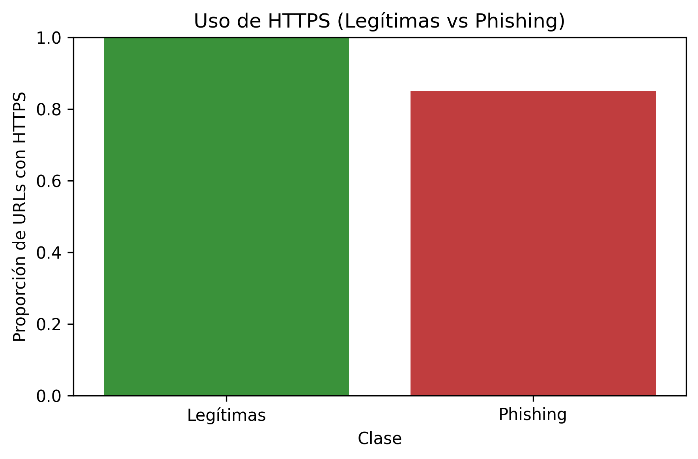
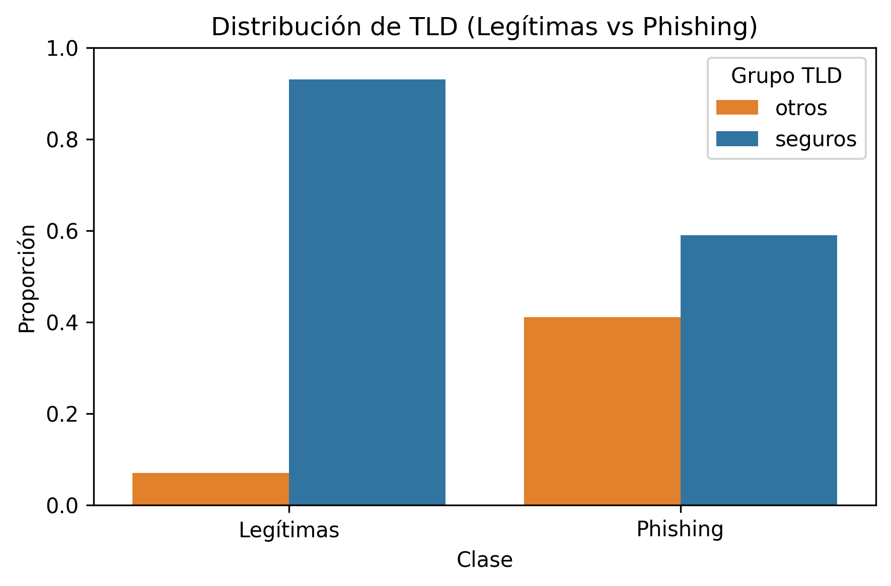
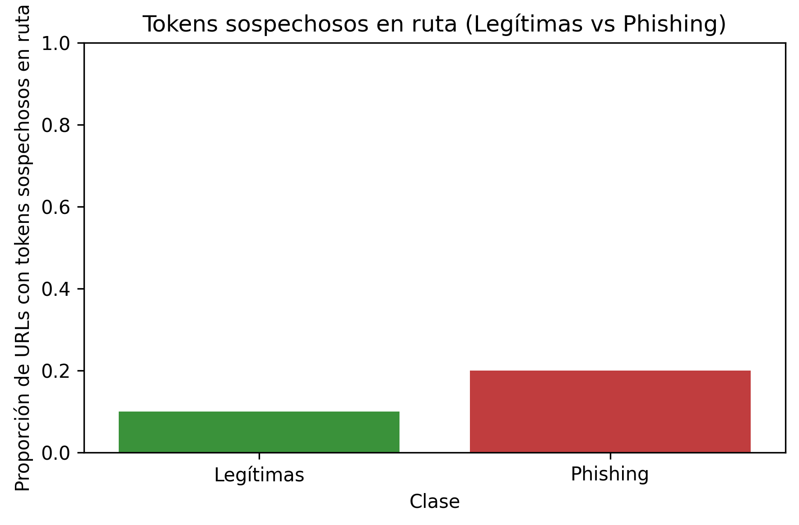
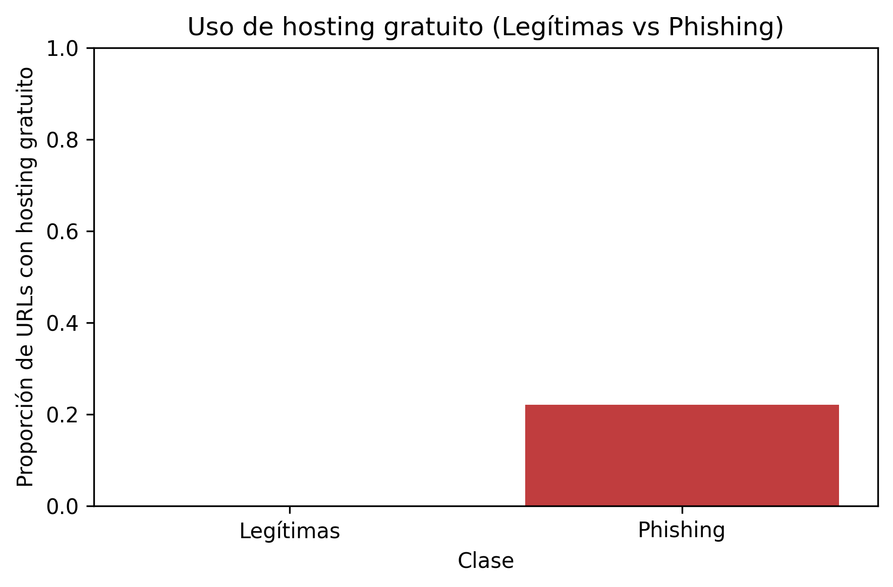

# 🧩 Feature Engineering – Prototipo Phishing

En este Readme se explica la elección de **10 features** para el primer prototipo de detección de phishing.

El dataset contiene **200 URLs balanceadas** (100 legítimas vs 100 phishing), por lo que se decidió elegir un número reducido de features, que sean explicables y fáciles de interpretar, tengan suficinente representatividad (o que sean propias de únicamente una etiqueta) y que cubran diferentes sectores (longitud, entropía, símbolos...). 

Cada feature se analiza de la siguiente forma:

- **Descripción** → Qué mide.
- **Resultados** → Observaciones en el dataset.
- **Criterios de selección** → Umbrales usados para decidir validez.
- **Clasificación** → fuerte, moderada o de nicho.
Además, en caso de que el **EDA muestre tendencias claras y consistentes**, se puede mantener una feature aunque no cumpla estrictamente los umbrales definidos.

Los criterios aplicados fueron:  
- Diferencia relativa ≥ **50%** → feature fuerte.  
- Diferencia relativa ≥ **30%** (pero <50%) → feature moderada.  
- Diferencia absoluta ≥ **10 puntos porcentuales** → feature fuerte.  
- Para features con valores bajos (media <10):  
  - Diferencia absoluta ≥ **5 caracteres** → fuerte.  
  - Diferencia absoluta ≥ **3 caracteres** → moderada.  
- Exclusividad (0% en una clase, >0% en la otra) → feature específica.  
  - Nota: si en futuras ampliaciones de dataset no ganan representatividad, se eliminarán.
- Excepción: si en el EDA se detectan patrones consistentes, se pueden mantener provisionalmente pese a no alcanzar los umbrales.    

Las gráficas asociadas están en la carpeta `img/`.

## 1. `domain_length`
**Descripción:** número de caracteres en el dominio principal de la URL.  
Los dominios de phishing tienden a ser más largos porque suelen incluir palabras adicionales (ej. *seguridad*, *verificación*) o variaciones de marcas legítimas.  
**Resultados:**  
- Legítimas → media = **8.1** ± 3.8  
- Phishing → media = **11.3** ± 5.1  
- Diferencia relativa = **+38%**  
- Diferencia absoluta = **+3.2 caracteres**  
**Representatividad:** en ≈80% de los casos, los dominios phishing superan la longitud media de los dominios legítimos, lo que confirma una tendencia consistente.  
**Criterios de selección:** cumple diferencia relativa ≥30%.  
**Clasificación:** Moderada.  

## 2. `domain_entropy`
**Descripción:** mide la aleatoriedad de los caracteres en el dominio.  
Los dominios phishing suelen tener mayor entropía porque utilizan nombres menos naturales, cadenas aleatorias o combinaciones extrañas para evadir detección (ej. `authline-checkappr0v.com.es`).  
**Resultados:**  
- Legítimas → media = **2.47** ± 0.55  
- Phishing → media = **2.89** ± 0.63  
- Diferencia relativa = **+17%**  
- Diferencia absoluta = **+0.42** 
**Representatividad:** aunque la diferencia no es muy grande, en ≈65% de los casos los dominios phishing presentan mayor entropía que la media de las legítimas, lo que indica un patrón consistente.   
**Criterios de selección:** Pese a no alcanzar los criterios, se mantiene al observar una tendencia clara en el EDA.
**Clasificación:** Moderada.  

## 3. `num_params`
**Descripción:** número de parámetros presentes en la query de la URL (`?a=1&b=2`).  
Los atacantes suelen añadir parámetros falsos o innecesarios para simular procesos de validación, tracking o formularios.  
**Resultados:**  
- Legítimas → 4% (4 de 100)  
- Phishing → 12% (12 de 100)  
- Diferencia relativa = **+200%**  
- Diferencia absoluta = **+8 puntos porcentuales**  
**Representatividad:** Aunque cumple con creces el criterio de diferencia relativa, la cobertura es baja, ya que solo aparece en ≈1 de cada 10 URLs phishing.  
**Criterios de selección:** Diferencia relativa >50%.  
**Clasificación:** Moderada.  

## 4. `trusted_path_token`
**Descripción:** detecta tokens de confianza en la ruta de la URL (ej. `clientes`, `empresas`, `banca`, `seguridad`, `login`).  
Estos términos son comunes en webs oficiales de bancos y servicios legítimos, mientras que en phishing aparecen con mucha menor frecuencia.  
**Resultados:**  
- Legítimas → 33% (33 de 100)  
- Phishing → 5% (5 de 100)  
- Diferencia absoluta = **28 puntos porcentuales**  
- Diferencia relativa = **+560%**  
**Representatividad:** una de cada tres URLs legítimas incluye estos tokens, frente a solo 1 de cada 20 phishing.  
**Criterios de selección:** cumple diferencia absoluta y relativa.  
**Clasificación:** ✅ Fuerte (feature legitimadora).  

  

## 5. `contains_percent`
**Descripción:** presencia del símbolo `%` en la URL.  
El `%` se utiliza en codificación de caracteres (`URL encoding`), por ejemplo `p%c3%a1gina` en lugar de `página`.    
**Resultados:**  
- Legítimas → 0% (0 de 100)  
- Phishing → 6% (6 de 100)  
**Representatividad:** señal exclusiva de phishing. Aparece en más casos que `@`, aunque sigue siendo minoritaria en el dataset. Puede aportar valor en combinación con otras features.  
**Criterios de selección:** exclusividad (solo phishing).  
**Clasificación:**  De nicho.   

## 6. `contains_equal`
**Descripción:** presencia del símbolo `=` en la URL.  
Este símbolo aparece habitualmente en parámetros de consulta (`?a=1&b=2`).  
En phishing suele utilizarse para:  
- Simular formularios de validación o login.  
- Añadir tokens falsos de sesión.  
- Construir URLs más creíbles con datos codificados.  
**Resultados:**  
- Legítimas → 3% (3 de 100)  
- Phishing → 8% (8 de 100)  
- Diferencia relativa = **+167%**  
- Diferencia absoluta = **+5 puntos porcentuales**  
**Representatividad:** aunque la diferencia relativa es grande, la cobertura total es baja (<10% de URLs). Sirve como feature complementaria, pero no suficiente por sí sola.  
**Criterios de selección:** diferencia relativa >50%.  
**Clasificación:**  Moderada.  
  

## 7. `protocol`
**Descripción:** identifica si la URL utiliza `http` o `https`.  
Tradicionalmente, el uso de `http` era un indicador claro de phishing, ya que los atacantes evitaban pagar certificados TLS.  
**Resultados:**  
- Legítimas → 100% usan `https` (100 de 100)  
- Phishing → 85% usan `https`, 15% todavía usan `http`  
- Diferencia absoluta = **15 puntos porcentuales**  
**Representatividad:** cualquier URL legítima de la muestra utiliza `https`. La presencia de `http` es por tanto exclusiva de phishing, aunque solo se da en 15 de 100 casos.  
**Criterios de selección:** diferencia absoluta >10 puntos.  
**Clasificación:** Fuerte (aunque su relevancia es decreciente en datasets modernos, ya que la mayoría de campañas actuales también usan TLS).  

## 8. `tld_group`
**Descripción:** TLD agrupado en dos categorías:  
- **Seguros** → `.es`, `.com`, más `.us` y `.network` (en este dataset solo aparecen en servicios legítimos).  
- **Otros** → cualquier otro TLD.  
En el contexto español, los dominios legítimos se concentran en `.es` y `.com`, mientras que el phishing tiende a diversificarse en TLDs alternativos, más baratos o menos regulados (`.app`, `.top`, `.xyz`, `.me`, `.site`, etc.).  
**Resultados:**  
- Legítimas → 93% seguros, 7% otros  
- Phishing → 59% seguros, 41% otros  
- Diferencia absoluta = **34 puntos**  
**Representatividad:** 41 de 100 phishing utilizan TLDs fuera del grupo seguro, frente a 7 de 100 legítimas. Esto convierte a `tld_group` en una de las señales más claras y robustas del dataset.  
**Criterios de selección:** diferencia absoluta >30 puntos.  
**Clasificación:** Fuerte.  
**Nota:** en este prototipo, `.us` y `.network` se reclasifican como seguros porque solo aparecen en URLs oficiales (Zoom y WalletConnect). En un dataset más amplio, esta decisión debería revisarse.  

## 9. `suspicious_path_token`
**Descripción:** detección de tokens sospechosos en la ruta de la URL (`php`, `html`, `index`, `view`, `principal`).  
Los atacantes suelen usar estos términos por defecto en páginas clonadas, formularios básicos o archivos maliciosos, en lugar de rutas semánticas típicas de sitios legítimos (`/clientes`, `/empresas`, `/seguridad`).  
**Resultados:**  
- Legítimas → 10% (10 de 100)  
- Phishing → 20% (20 de 100)  
- Diferencia relativa = **+100%**  
- Diferencia absoluta = **+10 puntos porcentuales**  
**Representatividad:** 1 de cada 5 URLs phishing contiene tokens sospechosos en la ruta, frente a 1 de cada 10 legítimas. No es una señal decisiva, pero sí un refuerzo útil al combinarla con otras features.  
**Criterios de selección:** diferencia relativa >50%.  
**Clasificación:** Moderada.  
  

## 10. `free_hosting`
**Descripción:** detecta si la URL pertenece a un dominio de hosting gratuito (ej. `webcindario.com`, `blogspot.com`, `sites.google.com`, `web.app`, etc.), ampliamente utiilizados en phsihing.  
**Resultados:**  
- Legítimas = 0%  
- Phishing = 22%  
- Diferencia absoluta = 22 puntos (exclusivo de phishing).  
**Criterios de selección:** exclusividad con cobertura media-alta.  
**Clasificación:** 🔹 Específica.  

## Features descartadas

### `path_depth`
- **Descripción:** número de segmentos en la ruta (`/`).  
- **Resultados:** legítimas media = 4.2, phishing media = 3.3.  
- **Diferencia absoluta = 0.9, relativa = 21% → no alcanza criterios mínimos.**  
- **Conclusión:** descartada en el prototipo.  

### `contains_at`
- **Descripción:** presencia del símbolo `@` en la URL.  
- **Resultados:** aparece en 0 legítimas y 2 phishing (2%).  
- **Cobertura extremadamente baja, y en campañas modernas apenas se utiliza.**  
- **Conclusión:** descartada en el prototipo por falta de representatividad.  

##  Conclusión
El set final queda compuesto por:  
- **Fuertes:** 5 (`num_params`, `contains_equal`, `protocol`, `tld_group`, `trusted_path_token`).  
- **Moderadas:** 3 (`domain_length`, `domain_entropy`, `suspicious_path_token`).  
- **Específicas:** 2 (`contains_percent`, `free_hosting`).  

Este equilibrio asegura:  
- Cobertura → todas las URLs activan ≥4 features.  
- Variedad → mezcla de features estructurales, simbólicas, categóricas, de hosting y legitimadoras.  
- Explicabilidad → cada feature está justificada con datos, criterios y visualizaciones.  
- Transparencia → se documentan también las features descartadas (ej. `path_depth`, `contains_at`).  

## 📊 Resumen de features y gráficas

| Feature                | Tipo       | Gráfica                               | Clasificación |
|-------------------------|------------|---------------------------------------|---------------|
| `domain_length`         | Numérica   |  | Moderada      |
| `domain_entropy`        | Numérica   |  | Moderada      |
| `num_params`            | Numérica   |  | Moderada      |
| `trusted_path_token`    | Binaria    |  | **Fuerte** (legitimadora) |
| `contains_percent`      | Binaria    |  | De nicho     |
| `contains_equal`        | Binaria    |  | Moderada      |
| `protocol`              | Binaria    |  | **Fuerte**    |
| `suspicious_path_token` | Binaria    |  | Moderada      |
| `free_hosting`          | Binaria    |  | Específica    |
| `tld_group`             | Categórica |  | **Fuerte**    |
