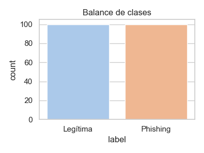
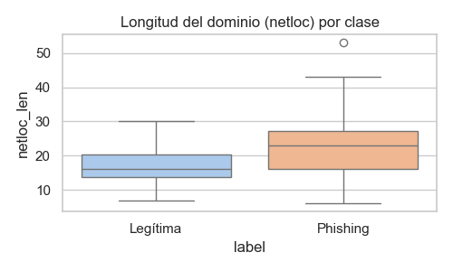
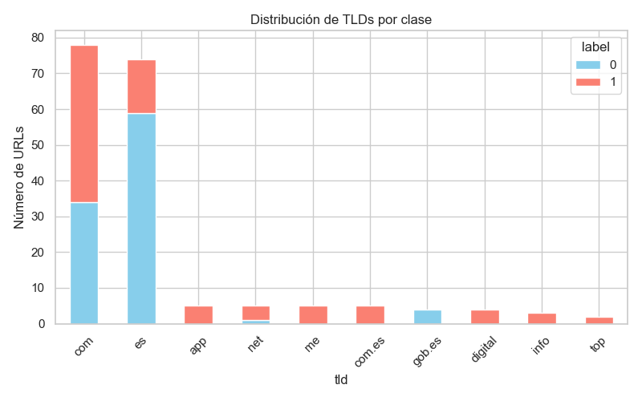
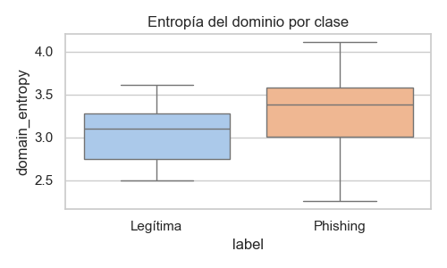

# 📈 Visualización pedagógica – EDA phishing vs legítimas

Este .MD compagina el notebook del EDA del prototipo, se analizan los resultados obtenidos en cada sección que se trató en el notebook. 

---

##  Distribución general

- Balance de clases: 100 legítimas (50 %), 100 phishing (50 %).  
- Distribución por categoría y clase:  
  - **Cobertura fuerte**: banca (80), SaaS (18), público, telecomunicaciones, logística.  
  - **Cobertura débil**: RRSS, energía, seguros, viajes, e-commerce (phishing ausente), genérico (legítimas ausentes).  
- **Acción**: ampliar phishing en sectores con solo legítimas, y viceversa.

---

##  Parsing de URLs

- Se extrajeron los componentes estructurales: `scheme`, `netloc`, `path`, `query`, `fragment`, `root_domain`.  
- Se generaron métricas de longitud para cada parte de la URL (`url_len`, `netloc_len`, `path_len`, etc.).

---

##  Señales estructurales

- Métricas agregadas por clase:  
  - `digits_in_netloc`: ausente en legítimas, presente en phishing → señal clara.  
  - `specials_in_netloc`: algo mayor en phishing.  
  - `netloc_len`: mayor en phishing.

---

##  Tokens en dominios

- Tokens más frecuentes en legítimas: `www`, `es`, `com`, y nombres de marca (`ing`, `bbva`, `caixabank`, etc.).  
- Tokens frecuentes en phishing: `webcindario`, `app`, `cliente`, `soporte`, `digital`, etc.  
- **Riesgo de sobreajuste**: tokens de marca pueden dar señales “demasiado” fuertes → cuidado al usarlos sin generalizar.

---

##  TLDs y acortadores

- `.es`, `.gob.es` → presentes casi exclusivamente en legítimas.  
- `.me`, `.top`, `.app`, `.info`, `.com.es` → solo aparecen en phishing.  
- `.com` y `.net` están presentes en ambos, pero con usos distintos.  
- **Uso de acortadores**: marginal (solo 1 caso detectado).

---

##  Path y query

- Se buscó presencia de palabras clave en español (`cliente`, `seguridad`, `envio`, `dgt`, `correos`, etc.).  
- Resultado:  
  - Legítimas: 22 % con keywords en `path`.  
  - Phishing: 8 % con keywords en `path`.  
  - `query`: casi siempre vacío (ambas clases).  
- **Acción**: palabras clave útiles, pero con cobertura limitada.

---

##  Medidas avanzadas

- `domain_entropy`: mayor en phishing → indica aleatoriedad o generación automática de dominios.  
- `path_depth`: mayor en legítimas → estructuras de navegación más profundas y reales.  
- `num_params`: bajo en ambos → `query` poco usado.

---

## 1 Síntesis final

- **Señales fuertes encontradas**:  
  - Longitud del dominio (`netloc_len`)  
  - Entropía del dominio (`domain_entropy`)  
  - Uso de ciertos TLDs y tokens  
  - Presencia de dígitos y caracteres especiales  
  - Palabras clave en el path  
  - Estructuras profundas (`path_depth`)  

- **Sesgos detectados**:  
  - Tokens de marca podrían sobreajustar si no se generalizan.  
  - Algunos sectores están desequilibrados por clase (e-commerce, genérico).  

- **Acciones sobre los datos**:  
  - Enriquecer sectores infrarrepresentados.  
  - Generalizar tokens de marca.  
  - Reforzar presencia de URLs con `query` y `parametros`.  

- **Lista de *features candidatas* para el modelo**:  
  - `url_len`, `netloc_len`, `path_len`, `query_len`  
  - `path_depth`, `num_params`  
  - `digits_in_netloc`, `specials_in_netloc`  
  - `domain_entropy`  
  - `host_tokens`  
  - `kw_in_path`, `kw_in_query`  
  - `scheme`, `tld`, `is_shortener`  
  - `target_in_root_domain`  

---
